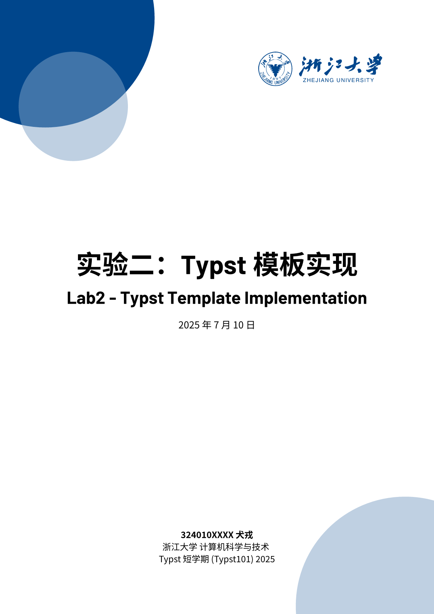
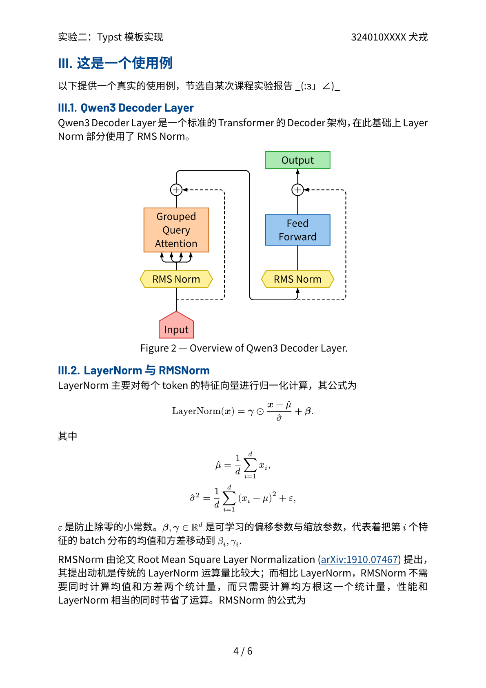

# zju-bubble-template

浙江大学风格的 Typst 模板，基于 [hzkonor/bubble-template](https://github.com/hzkonor/bubble-template) 二次开发。

## 特点

- 保留 bubble-template 的简洁多彩风格
- 内置浙大蓝与浙大校徽，适配浙江大学视觉元素
- 支持自定义主色、作者、标题、日期、Logo 等
- 页眉自动显示标题与作者，页码居中

适用于浙江大学各类文档、作业、报告等场景。

## 预览

见仓库中的 `main.typ` 示例及其导出的 `main.pdf`。

| 封面                            | 使用例                                 |
| ------------------------------- | -------------------------------------- |
|  |  |

## 使用

克隆仓库到工作目录下，再使用 `#import` 语句导入。随后就和 `main.typ` 中一样。

```typ
#import "zju-bubble-template/template.typ"
```

## License

MIT-0 License, consistent with [hzkonor/bubble-template](https://github.com/hzkonor/bubble-template).